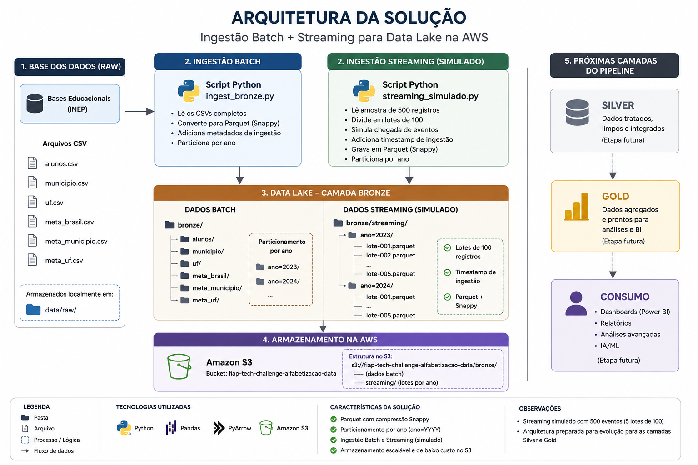

# FIAP Tech Challenge — Avaliação da Alfabetização

## 1. Objetivo

Este projeto tem como objetivo estruturar os dados da Avaliação da Alfabetização, disponibilizados pela Base dos Dados, utilizando uma arquitetura de dados em camadas.

A primeira etapa do projeto consiste na ingestão e organização dos dados brutos, preparando-os para as etapas posteriores do pipeline.

---

## 2. Fonte dos dados

Os dados utilizados são provenientes da Base dos Dados, a partir do conjunto:

**Avaliação da Alfabetização**

A tabela de alunos possui **3.867.999 registros**, referentes aos anos de 2023 e 2024.

Os dados foram obtidos em formato CSV e armazenados inicialmente na camada `RAW` do projeto.

### Arquivos utilizados

- `alunos.csv`
- `br_inep_avaliacao_alfabetizacao_municipio.csv`
- `br_inep_avaliacao_alfabetizacao_uf.csv`
- `br_inep_avaliacao_alfabetizacao_meta_alfabetizacao_brasil.csv`
- `br_inep_avaliacao_alfabetizacao_meta_alfabetizacao_municipio.csv`
- `br_inep_avaliacao_alfabetizacao_meta_alfabetizacao_uf.csv`

Fonte: Base dos Dados — Avaliação da Alfabetização.

---

## 3. Arquitetura de dados

O projeto utiliza uma organização em camadas seguindo o conceito de arquitetura de dados em modelo medalhão:

```text
Dados de origem
      ↓
     RAW
      ↓
    BRONZE
      ↓
    SILVER
      ↓
     GOLD
```

A **Fase 1** concentra-se na arquitetura, ingestão, armazenamento e organização da camada Bronze.

As camadas Silver e Gold foram preparadas no armazenamento em nuvem para utilização nas fases seguintes, mas **não fazem parte da implementação da Fase 1**.

### Fluxos de ingestão

A arquitetura contempla dois fluxos:

- **Batch:** processamento dos arquivos CSV completos disponibilizados pela Base dos Dados.
- **Streaming simulado:** processamento de uma amostra de 500 registros da tabela de alunos, dividida em 5 lotes de 100 registros, simulando a chegada contínua de eventos.

---

## 3.1 Ingestão Batch

O fluxo Batch é responsável por carregar os arquivos CSV da camada `RAW` e convertê-los para o formato **Parquet**.

O processamento é realizado pelo script:

```text
src/ingest_bronze.py
```

Durante a ingestão:

- os arquivos CSV são carregados;
- os dados são convertidos para Parquet;
- é utilizada compressão Snappy;
- os dados são particionados por ano;
- os arquivos são organizados na camada Bronze.

Ao final da ingestão Batch foram gerados **13 arquivos Parquet**, totalizando aproximadamente **57,3 MiB**.

### Base de alunos

A tabela `alunos` contém:

- **1.747.439 registros em 2023**
- **2.120.560 registros em 2024**
- **3.867.999 registros no total**

---

## 3.2 Ingestão Streaming simulada

Como parte da arquitetura híbrida exigida pelo projeto, também foi implementada uma simulação de ingestão em Streaming.

O fluxo é executado pelo script:

```text
src/streaming_simulado.py
```

Para a simulação foram utilizados **500 registros** da tabela de alunos.

Os registros são processados em:

```text
5 lotes × 100 registros
```

Cada lote é gravado individualmente em formato Parquet, mantendo o particionamento por ano.

A validação da simulação confirmou:

- **10 arquivos Parquet**
- **500 eventos processados**
- **251 registros de 2023**
- **249 registros de 2024**

Estrutura gerada:

```text
data/
└── bronze/
    └── streaming/
        ├── ano=2023/
        │   ├── lote-001.parquet
        │   ├── lote-002.parquet
        │   ├── lote-003.parquet
        │   ├── lote-004.parquet
        │   └── lote-005.parquet
        │
        └── ano=2024/
            ├── lote-001.parquet
            ├── lote-002.parquet
            ├── lote-003.parquet
            ├── lote-004.parquet
            └── lote-005.parquet
```

---

## 3.3 Organização da camada Bronze

A camada Bronze Batch possui a seguinte estrutura:

```text
data/
└── bronze/
    ├── alunos/
    │   ├── ano=2023/
    │   │   └── part-000.parquet
    │   └── ano=2024/
    │       └── part-000.parquet
    │
    ├── municipio/
    │   ├── ano=2023/
    │   │   └── part-000.parquet
    │   └── ano=2024/
    │       └── part-000.parquet
    │
    ├── uf/
    │   ├── ano=2023/
    │   │   └── part-000.parquet
    │   └── ano=2024/
    │       └── part-000.parquet
    │
    ├── meta_brasil/
    │   ├── ano=2023/
    │   ├── ano=2024/
    │   └── ano=2025/
    │
    ├── meta_municipio/
    │   ├── ano=2023/
    │   └── ano=2024/
    │
    ├── meta_uf/
    │   ├── ano=2023/
    │   └── ano=2024/
    │
    └── streaming/
        ├── ano=2023/
        └── ano=2024/
```

---

## 3.4 Armazenamento na AWS

Após o processamento local, os dados da camada Bronze foram disponibilizados no **Amazon S3**.

### Bucket

```text
fiap-tech-challenge-alfabetizacao-data
```

### Região

```text
sa-east-1
```

### Estrutura do armazenamento

```text
s3://fiap-tech-challenge-alfabetizacao-data/
├── bronze/
│   ├── alunos/
│   ├── municipio/
│   ├── uf/
│   ├── meta_brasil/
│   ├── meta_municipio/
│   ├── meta_uf/
│   └── streaming/
│
├── silver/
│
└── gold/
```

A camada `Bronze` contém os dados efetivamente processados na Fase 1.

As pastas `silver/` e `gold/` foram criadas no S3 para preparar a infraestrutura para as fases seguintes.

### Acesso ao armazenamento

Os dados processados da camada Bronze estão armazenados no Amazon S3:

**Bucket:** `fiap-tech-challenge-alfabetizacao-data`  
**Região:** `sa-east-1`

O armazenamento pode ser consultado pelo console da AWS:

[Amazon S3 — Console](https://s3.console.aws.amazon.com/s3/buckets/fiap-tech-challenge-alfabetizacao-data)

> O acesso ao console depende de autenticação na conta AWS. O bucket não foi tornado público apenas para fins de documentação.

---

### Validação do S3

A validação final do bucket confirmou:

- **23 objetos de dados na Bronze**
- aproximadamente **57,4 MiB** armazenados;
- **13 objetos** referentes ao processamento Batch;
- **10 objetos** referentes ao Streaming simulado;
- diretórios `silver/` e `gold/` preparados.

---

## 3.5 Diagrama da arquitetura

A arquitetura implementada nesta etapa está representada no diagrama abaixo:



O diagrama apresenta os fluxos de ingestão Batch e Streaming simulado, a organização da camada Bronze, o armazenamento no Amazon S3 e a evolução planejada para as camadas Silver e Gold.

---

## 4. Decisões de arquitetura

### Parquet

Foi adotado o formato **Parquet** para a camada Bronze em substituição ao armazenamento dos dados processados em CSV.

A escolha permite trabalhar com um formato colunar adequado a consultas analíticas e reduz o volume de armazenamento em comparação com os arquivos CSV originais.

### Compressão Snappy

Os arquivos Parquet são gravados utilizando **Snappy**, buscando reduzir o espaço ocupado sem adicionar uma etapa excessivamente pesada de processamento.

### Particionamento por ano

Os dados são particionados utilizando a coluna `ano`, produzindo uma estrutura como:

```text
ano=2023/
ano=2024/
```

Esse particionamento organiza os dados por período e prepara a estrutura para consultas mais eficientes nas próximas etapas do pipeline.

### Separação por camadas

A arquitetura utiliza a separação:

```text
RAW → BRONZE → SILVER → GOLD
```

Cada camada possui uma finalidade específica, permitindo que as transformações sejam realizadas progressivamente sem alterar os dados de origem.

---

## 5. FinOps

As decisões de armazenamento e processamento consideraram o custo da infraestrutura desde o início do projeto.

### Estratégias adotadas

- utilização de **Parquet**;
- compressão **Snappy**;
- particionamento por ano;
- armazenamento dos dados processados em **Amazon S3**;
- ausência de serviços AWS adicionais desnecessários nesta fase;
- uso de uma simulação de Streaming local, evitando a necessidade de manter uma infraestrutura de streaming real para a demonstração.

### Controle de orçamento

Foi criado um **AWS Budget mensal de US$ 5,00** para acompanhamento dos custos do projeto.

O objetivo é monitorar o consumo dos recursos AWS utilizados durante o desenvolvimento e evitar custos inesperados.

---

## 6. Estrutura do projeto

```text
FIAP/
├── data/
│   ├── raw/
│   └── bronze/
│
├── docs/
│   └── arquitetura-solucao.png
│
├── src/
│   ├── ingest_bronze.py
│   └── streaming_simulado.py
│
├── .venv/
│
└── README.md
```

---

## 7. Tecnologias utilizadas

- Python
- Pandas
- PyArrow
- Parquet
- Amazon S3
- AWS CLI
- Visual Studio Code

---

## 8. Entregas da Fase 1

Ao final da Fase 1, foram concluídas as seguintes entregas:

- infraestrutura de armazenamento configurada na AWS;
- estrutura de camadas `Bronze`, `Silver` e `Gold` preparada no S3;
- dados brutos disponíveis na camada Bronze;
- ingestão Batch implementada;
- ingestão Streaming simulada implementada;
- dados convertidos para Parquet;
- particionamento por ano implementado;
- dados enviados e validados no Amazon S3;
- controle de custos com AWS Budget;
- estrutura inicial do repositório criada;
- diagrama inicial da arquitetura documentado;
- README atualizado com as decisões técnicas da Fase 1.

---

## 9. Próximas fases

### Fase 2 — Tratamento, integração e camada Silver

Responsável: **Pessoa 2**

A próxima fase será responsável pela limpeza, padronização, integração e validação dos dados, produzindo a camada Silver.

### Fase 3 — Camada Gold, consultas, visualizações e vídeo

Responsável: **Pessoa 3**

A terceira fase será responsável pela criação da camada Gold, consultas analíticas, visualizações, documentação final e vídeo executivo.

---

## 10. Status

**Fase 1 — Arquitetura, nuvem e ingestão: CONCLUÍDA ✅**

A infraestrutura, ingestão Batch, simulação de Streaming, camada Bronze, armazenamento no S3, preparação das camadas seguintes, documentação e controle inicial de custos foram implementados e validados.
