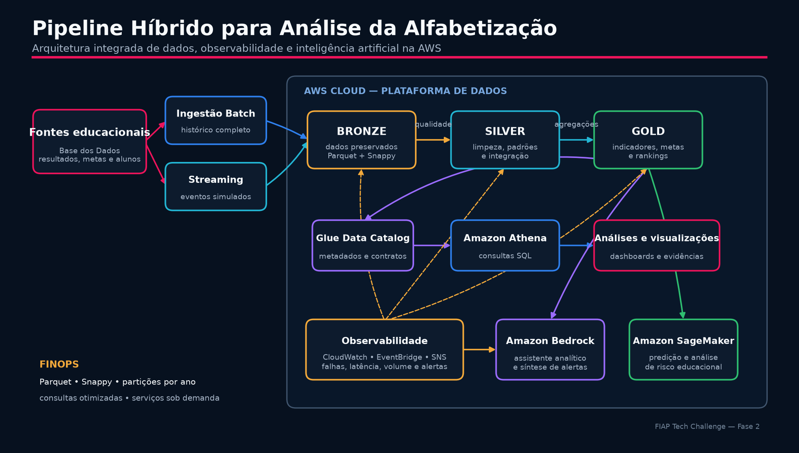

# FIAP Tech Challenge — Pipeline Híbrido para Análise da Alfabetização

## Contexto

A alfabetização na infância é essencial para o desenvolvimento educacional e
social. O projeto utiliza dados do Indicador Criança Alfabetizada, da Base dos
Dados, para integrar resultados, metas e microdados educacionais. O indicador
considera alfabetizado o estudante que atinge o nível definido na escala do
Saeb e permite acompanhar desigualdades e a evolução das metas até 2030.

O desafio consiste em construir uma plataforma de dados híbrida, escalável e
confiável para apoiar análises e políticas públicas baseadas em evidências.

## Arquitetura da solução



```text
Fontes educacionais
        ↓
Ingestão batch + streaming simulado
        ↓
Amazon S3: Bronze → Silver → Gold
        ↓
Catálogo e consultas analíticas
        ↓
Visualizações, monitoramento e aplicações de IA
```

- **Bronze:** preservação dos dados ingeridos em Parquet Snappy, particionados por ano.
- **Silver:** limpeza, tipagem, padronização, integração e validações de qualidade.
- **Gold:** indicadores por município, UF e Brasil, metas, rankings e evolução temporal.
- **Consumo:** consultas SQL, visualizações, dashboards e aplicações de inteligência artificial.

O fluxo batch processa o histórico completo. O streaming simulado representa a
chegada contínua de eventos, com 500 registros organizados em lotes.

## Resultados

As três fases técnicas estão concluídas:

| Fase | Entrega | Situação |
|---|---|---|
| 1 | Arquitetura, ingestão híbrida e Bronze | Concluída |
| 2 | Tratamento, integração, Silver e qualidade | Concluída |
| 3 | Gold, consultas, visualizações e IA aplicada | Concluída |

Principais produtos analíticos:

- 10.704 indicadores municipais;
- 54 indicadores por UF;
- 2 indicadores nacionais, referentes a 2023 e 2024;
- cinco visualizações para metas, evolução e desigualdades territoriais.

Em 2024, o indicador nacional foi 59,2%, diante da meta de 59,9%, com evolução
de +3,3 pontos percentuais em relação a 2023.

## Qualidade e governança

O pipeline verifica duplicidades, valores ausentes, chaves de relacionamento e
consistência entre tabelas. Também produz manifestos e relatórios de execução.
A validação final não apresentou erros bloqueantes.

Os dados individuais permanecem nas camadas de processamento. A camada Gold
oferece apenas informações agregadas adequadas ao consumo analítico.

## Monitoramento

A arquitetura prevê o Amazon CloudWatch para acompanhar falhas, duração,
latência e volume processado. EventBridge e Amazon SNS podem distribuir alertas
operacionais. O Amazon Bedrock pode transformar métricas e relatórios de
qualidade em resumos objetivos, sugerindo possíveis causas e próximos passos,
sempre com validação humana.

## Aplicação de inteligência artificial

O Amazon Bedrock pode disponibilizar um assistente analítico sobre a camada
Gold, permitindo perguntas em linguagem natural, geração de resumos para
gestores e apoio à interpretação de alertas. Para modelos preditivos tabulares,
como risco de não atingimento das metas, a camada Gold pode alimentar modelos
no Amazon SageMaker.

Os usos propostos incluem:

- previsão da evolução da alfabetização;
- identificação de municípios com maior risco educacional;
- análise de desigualdades territoriais;
- síntese de indicadores para políticas públicas;
- triagem e contextualização de alertas do pipeline.

Detalhes em [`docs/registro-uso-ia.md`](docs/registro-uso-ia.md).

## FinOps

As decisões de arquitetura reduzem custo sem comprometer a análise:

- Parquet e compressão Snappy reduzem armazenamento e leitura;
- particionamento por ano evita varreduras desnecessárias;
- consultas sobre a camada Gold reduzem o volume processado;
- serviços gerenciados e execução sob demanda evitam capacidade ociosa;
- métricas de uso permitem acompanhar volume, duração e consumo.

## Decisões e trade-offs

- **Batch e streaming:** batch garante reprocessamento histórico; streaming atende eventos recentes e adiciona complexidade operacional.
- **Data lake e warehouse:** o data lake preserva flexibilidade e baixo custo; a Gold fornece o contrato analítico necessário ao consumo.
- **Custo e performance:** arquivos colunares, partições e agregações antecipadas favorecem consultas rápidas com menor leitura.

## Reprodução e validação

Requer Python 3.11 ou superior.

```powershell
python -m venv .venv
.venv\Scripts\Activate.ps1
pip install -r requirements.txt
python -m src.pipeline all
python -m pytest -q
```

Resultado de referência: `9 passed`.

## Estrutura e evidências

- [Mapa das pastas](docs/estrutura-do-projeto.md)
- `data/bronze/`: dados de entrada em Parquet
- `data/silver/`: dados tratados, integrados e validados
- `data/gold/`: indicadores e agregações analíticas
- [Implementação técnica das Fases 2 e 3](docs/implementacao-fases-2-3.md)
- [Registro e proposta de uso de IA](docs/registro-uso-ia.md)
- [Visualizações e resumos analíticos](docs/evidencias/fase-3/)

As definições e consultas do Amazon Athena estão em `sql/athena/`. Consultas
complementares de validação estão versionadas em `sql/analytics/`.

## Tecnologias

Python, Pandas, DuckDB, PyArrow, Parquet, Amazon S3, AWS Glue Data Catalog,
Amazon Athena, Amazon CloudWatch, Amazon Bedrock e Amazon SageMaker.

O código, os testes e a documentação estão versionados em branches de
desenvolvimento e integrados à branch principal do projeto.
