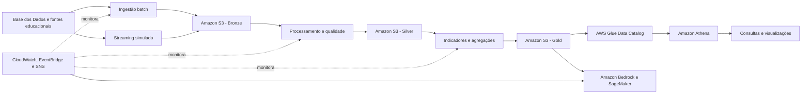

# Arquitetura completa da solução

A solução integra ingestão batch e streaming, armazenamento em arquitetura
medalhão, processamento de qualidade, consultas analíticas, observabilidade e
aplicações de inteligência artificial.

O diagrama visual em alta resolução está em
[`docs/arquitetura-completa.png`](arquitetura-completa.png).
