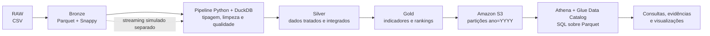

# Arquitetura complementar — Fases 2 e 3

O arquivo `arquitetura-solucao.png` registra a implementação da Fase 1 e, por isso, apresenta Silver, Gold e consumo como etapas futuras. Ele não está incorreto. Para as Fases 2 e 3, a arquitetura passa a incluir o Amazon Athena como mecanismo de consulta sobre os arquivos Gold publicados no Amazon S3.

O Athena não substitui nenhuma camada do modelo medalhão. Ele é a camada de consulta que lê os Parquets no S3 por meio de tabelas externas registradas no catálogo.

Nesta entrega temporária, a infraestrutura de nuvem é propositalmente mínima: um bucket privado, um banco lógico no catálogo e um workgroup do Athena. Não são necessários Glue Crawler, Glue Job, QuickSight, Lambda ou recursos provisionados.
